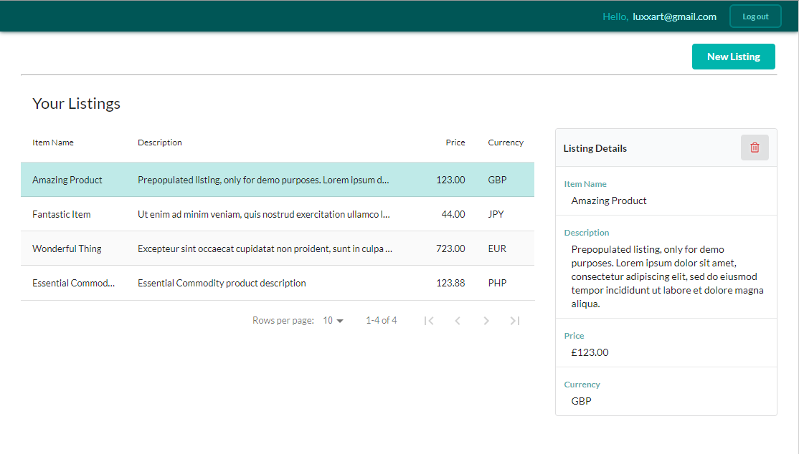
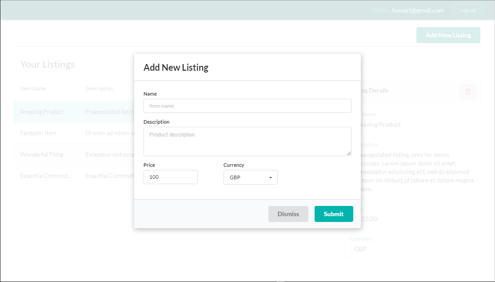

## On-line marketplace

Small demo application simulating a "global", unspecialised marketplace.

Features:
- user registration
- user authentication
- min password length + password match requirements on signup
- multitude of currencies (currently offered by fixer.io)
- user session persistence, via cookie
- local storage of user credentials
- local storage of user listings, on per-user basis
- automatic redirections, based on session state
- centralised configuration

Technologies used:

- React
- React Router
- [Redux](https://redux.js.org/)
- [Redux Toolkit](https://redux-toolkit.js.org/)
- Typescript
- Formik form validator
- Yup schema validator
- React Data Table Component
- Additional ESLint validation (beyond one in un-ejected React app)
- Semantic UI framework
- CSS modules

Testing:

- 21 unit tests

To do:

- data table showing all listings, not only user's (very similar component to the existing one needs to be created)
- fetching of Forex rates (easy, fetch and update with an appropriate action)
- making listings editable (it's very easy to launch the existing "Add new Listing" component with initial parameters)
- more tests, E2E
- security

## Screenshots

- Listings screen:

- Add new listing screen:

- Login screen:

- Thank you for signing up screen:

========================================================

## Available Scripts

In the project directory, you can run:

### `yarn start`

Runs the app in the development mode. 
Open [http://localhost:3000](http://localhost:3000) to view it in the browser.

The page will reload if you make edits. 
You will also see any lint errors in the console.

### `yarn test`

Launches the test runner in the interactive watch mode. 

### `yarn build`

Builds the app for production to the `build` folder. 
It correctly bundles React in production mode and optimizes the build for the best performance.

The build is minified and the filenames include the hashes. 
Your app is ready to be deployed!
